# Basic data cleaning and visualization with a "wines" dataset using pandas, matplotlib, and seaborn.

## Importing data, viewing structure, and checking for duplicates:

```python
wine =  pd.read_csv('/Users/alexweirth/Documents/CS-370/midterm/Wine.csv')

wine.shape

wine.head(3)
```
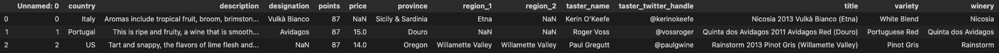

```python
duplicate_row_wine = wine[wine.duplicated()]
duplicate_row_wine.shape

wine[wine.duplicated()].count()

winedups = wine.duplicated(subset=None, keep=False)
print(winedups)
```
After checking for duplicates a few different ways I found no duplicate rows.

## Data Cleaning

### Removing columns that were not needed:

```python
 wine_2 = wine.drop(['Unnamed: 0', 'region_2', 'taster_name', 'taster_twitter_handle'], axis = 1)
```

### Checking null values and removing those observations:

```python
print(wine_2.isnull().sum())

wine_3 = wine_2.dropna()
wine_3.count()
```
I removed 67,835 null observations and was left with 70,175

## Exploratory Data Analysis

### Top 5 countries with the most observations in the data:

```python
wine_country_top5 = wine_3.country.value_counts().nlargest(5)
wine_country_top5
```

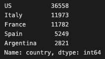

```python
wine_3.country.value_counts().nlargest(5).plot(kind = 'bar', figsize = (15, 5))
```

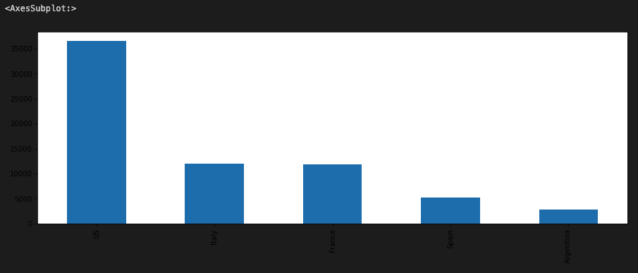

### Looking at the statistics for the numerical features of the wine data (points(rating of 0-100) & price):

```python
wine_3.describe()
```

Just looking at the summary statistics I was suprised there was a $2,013 bottle of wine and all the wines are rated very high with an average rating of 88.8 in the dataset.

### Creating new variables for wines from the United States and/or Italy and/or France:

```python
wine_select = wine_3[(wine_3["country"] == "US") | 
                   (wine_3["country"] == "Italy") | 
                    (wine_3["country"] == "France")]
```
```python
wine_US = wine_3[(wine_3["country"] == "US")]
wine_Italy = wine_3[(wine_3["country"] == "Italy")]
wine_France = wine_3[(wine_3["country"] == "France")]
```

#### For U.S. wines what states have the most observations in the data?

```python
wine_US_3_count = wine_US.province.value_counts().nlargest(3)
wine_US_3_count
```

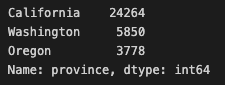

```python
wine_US_3 = wine_3[(wine_3["province"] == "Washington") | 
                   (wine_3["province"] == "California") | 
                    (wine_3["province"] == "Oregon")]
```

#### A density plot for the price of these wines from the top 3 U.S. states:

```python
sns.kdeplot(data = wine_US_3, x = "price")
plt.show()
```

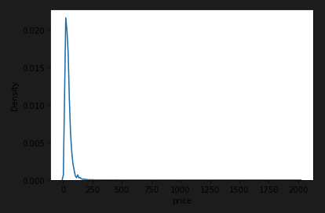

#### A density plot for the ratings of these wines from the top 3 U.S. states:

```python
sns.kdeplot(data = wine_US_3, x = "points")
plt.show()
```

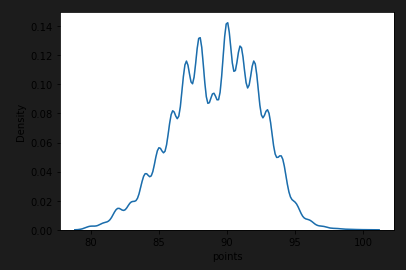

### Creating a variables for U.S. wines from WA/OR/CA with prices between $10-$50

```python
my_wine = wine_US_3[(wine_US_3["price"] <= 50) & 
                    (wine_US_3["price"] >= 10)]
```

#### Observing the difference of price & rating between each West Coast State:

```python
sns.boxplot(x = "province", y="price", data=my_wine)
```

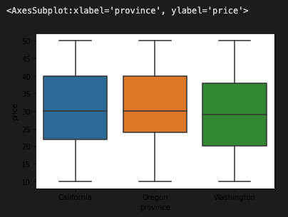

```python
sns.boxplot(x = "province", y="points", data=my_wine)
```

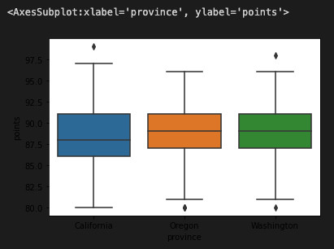

### Creating an Oregon wines variable:

```python
wine_OR = wine_US_3[(wine_US_3["province"] == 'Oregon')]
```

#### The top 3 wine varieties for Oregon:

```python
wine_OR.variety.value_counts().nlargest(3)
```

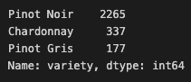

#### The price of the most expensive Oregon wine:

```python
most_exp_OR = wine_OR['price'].max()
print(most_exp_OR)
```
$275.00

#### Which regions of Oregon have the most observations in the dataset:

```python
wine_OR_5 = wine_OR.region_1.value_counts().nlargest(5)
wine_OR_5
```

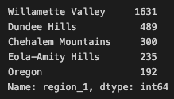

#### Price of the highest rated wine from Willamette Valley, OR:

```python
price_of_highest_rated = wine_OR[(wine_OR["region_1"] == "Willamette Valley")].nlargest(1, 'points')
price_of_highest_rated
```
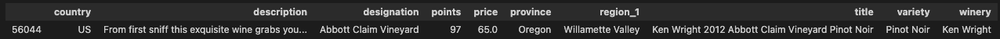

#### Rating of the most expensive wine from the Willamette Valley

```python
rating_of_most_exp = wine_OR[(wine_OR["region_1"] == "Willamette Valley")].nlargest(1, 'price')
rating_of_most_exp
```
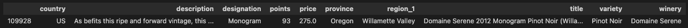

### Line plot with rating vs price for each West Coast state:

```python
sns.relplot(data = my_wine, x = 'points', y = 'price', hue = "province", kind = "line") 
plt.show()
```
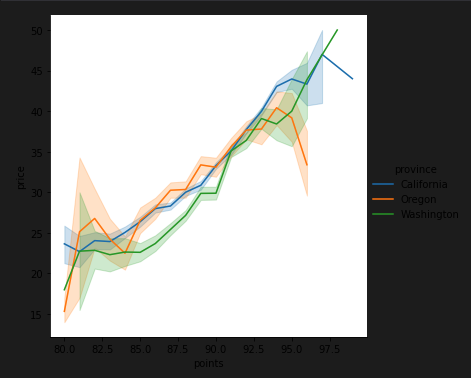


