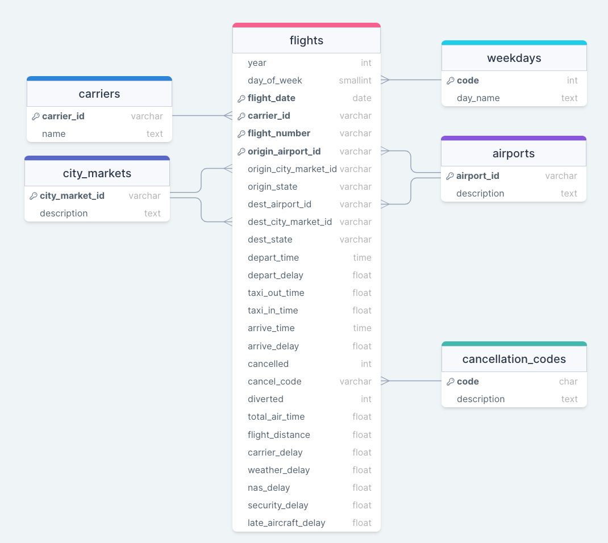
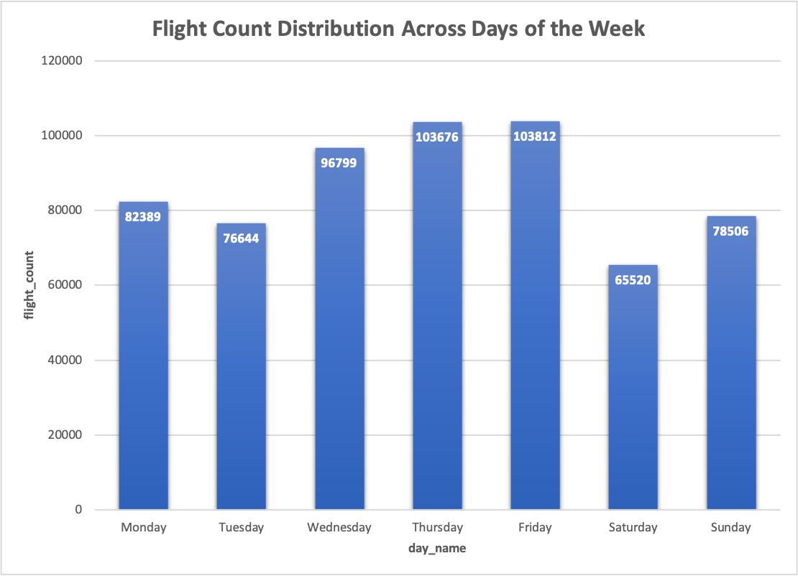

# Working with Bureau of Transportation Statistics Dataset of Flights

### Structure pictured below:



#### Querying the airport with the greatest average delay in arriving flights (minimum 100 ariving flights)

```sql
SELECT apts.description, AVG(flts.arrive_delay) AS avg_delay
FROM hw6.flights AS flts
LEFT JOIN hw6.airports AS apts 
  ON flts.origin_airport_id = apts.airport_id
GROUP BY apts.description
HAVING COUNT(*) > 100
ORDER BY avg_delay DESC LIMIT 1
;
```

#### Querying the 3 U.S. cities in descending order with the greatest number of inbound flights across all airports serving that city

```sql
SELECT cm.description AS airport, COUNT(cm.description) AS flight_count
FROM hw6.flights AS flts
LEFT JOIN hw6.city_markets as cm 
  ON cm.city_market_id = flts.dest_city_market_id
GROUP BY cm.description
ORDER BY COUNT(cm.description) DESC LIMIT 3
;
```

#### Querying the 5 airports that have the greatest number of outgoing flights per day on average (along with those averages)

```sql
-- This temp table is airports grouped by name, and then date meaning each entry in the table is groups of distinct aiport/date pairs and
-- a column that sums all the flights on that day for that distinct pair.
CREATE TEMP TABLE apfd AS (
  SELECT origin_airport_id, flight_date, COUNT(*) AS flights_perday
  FROM hw6.flights
  GROUP BY origin_airport_id, flight_date
  );

-- This query then joins the airport description (name) to the temp table apfd so we can group by airport (to which a bunch of 'flights
-- per day' values are related to, so we can take an average of those values which are grouped by airport to give us avg flights per
-- day of each airport.
SELECT apts.description, ROUND(AVG(apfd.flights_perday), 0) FROM apfd
LEFT JOIN hw6.airports as apts ON apts.airport_id = apfd.origin_airport_id
GROUP BY apts.description
ORDER BY ROUND(AVG(apfd.flights_perday), 0) DESC LIMIT 5
;
```

#### Querying the airports that represent the longest single flight distance for each airline (output is name of carrier, DEP and ARR airports flitering out duplicate round trips.)

```sql
-- This temp table is each carrier id paired with its longest flights distance
CREATE TEMP TABLE maxdist_flight AS(
  SELECT flts.carrier_id AS cid, MAX(flts.flight_distance) AS max_distance
  FROM hw6.flights as flts
  GROUP BY flts.carrier_id
  );

-- The DISTINCT ON query makes sure we only grab one observation from each grouping so we cannot have duplicates
SELECT DISTINCT ON(crs.name)crs.name AS carrier, mxd.max_distance, apts1.description AS origin_airport, apts2.description AS destination_airport
FROM maxdist_flight AS mxd
-- joining 'carriers' table to the mxd table so we are able to query the name of the carriers
LEFT JOIN hw6.carriers as crs 
  ON crs.carrier_id = mxd.cid
-- joining flights table back to temp table again so we can obtain origin & dest aiport ids which in a later join we can gdt the names for
-- these airports.
LEFT JOIN hw6.flights as flts 
  ON flts.carrier_id = mxd.cid AND flts.flight_distance = mxd.max_distance
-- joining airport name to mxd flight table so we can see airport name of the origin location
LEFT JOIN hw6.airports as apts1 
  ON apts1.airport_id = flts.origin_airport_id
-- joining airport name to mxd flight table so we can see airport name of the destination location
LEFT JOIN hw6.airports as apts2 
  ON apts2.airport_id = flts.dest_airport_id
ORDER BY crs.name
;
```

# Data Visualization with the flights dataset in Excel

### Simple bar chart showing the total number of flights departing each day of the week

#### Query to give me a CSV of counts of flights across each weekday:

```sql
COPY(
SELECT wd.day_name, COUNT(*) AS flight_count
FROM hw6.flights AS flts
LEFT JOIN hw6.weekdays AS wd 
  ON wd.code = flts.day_of_week
GROUP BY wd.code
)
TO '/Users/alexweirth/Documents/data_351/data/weekday_flights.csv'
WITH(FORMAT CSV, HEADER);
```

#### Visualization:


### Further Visualization: how do canceled flights vary among airlines? Specifically, are there observations we could make that show certain airlines having differing common cancellation types?

#### Goal: create a bar chart for airline cancelations colored by cancellation type.
